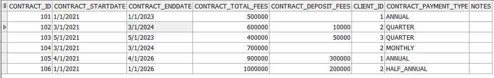
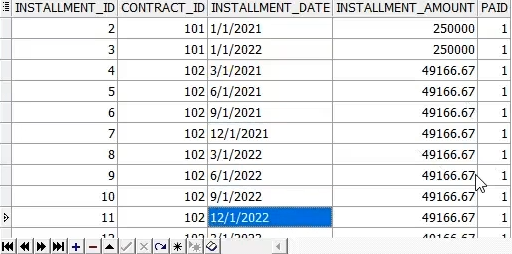

# PL/SQL Installments Oraganizer
 ## Just a simple PL/SQL Project read the ReadMe file. 
 
 Imagine we are a company that provides a service for it's customers, and provide the customers with the ability to pat for our services using long-term payment. 
 This code will help us to convert the contract's data of our customers into installments details like the provided picture.  
We want to go from   
  
To   

